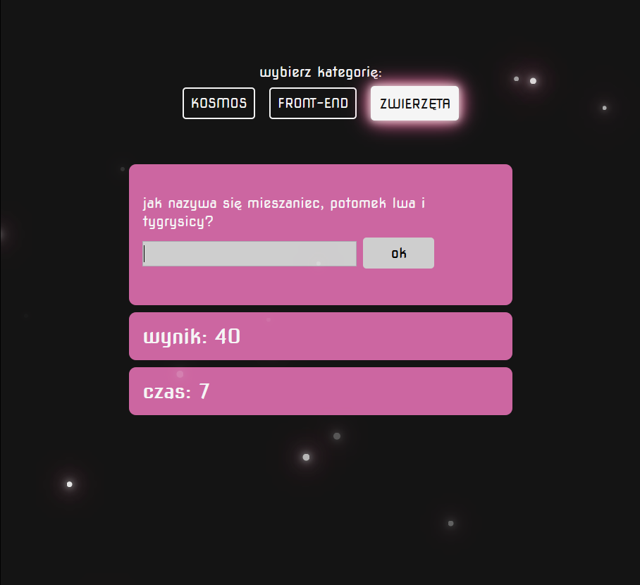

# Question Game
The first big project I made all by myself.
You can take the quiz here: [Quiz-game](https://pokorra.github.io/quiz-game/)

## How does it look like

## How does it work
This project is a quiz created (so far) only in Polish language. You can pic a category and after you do this, you will se time-limited questions. Depending on your answer your points number will be increased or reduced.

## Setup
To run this project, install it locally using npm: `npm install`.
Then just run it with `npm start` command and have some fun!

## Technologies
I made this project with create-react-app. I used functional components, so dynamics of this app is based on React Hooks. Since there was a lot of data flowing back and forth, I needed to use not only useState hook, but useEffect as well - especially because the quiz is time-limited. Working on this game helped me to learn a lot about designing a simple application.

## Layout
Layout of this site was written with the use of SCSS. Since one of the quiz categories is "Space", I have decided to make it look a little bit "spacey", with moving stars and glowing elements. Thanks to that, I've had an opportunity to excersize CSS animations and shadow effects, and I am quite satisfied with the outcome. 

